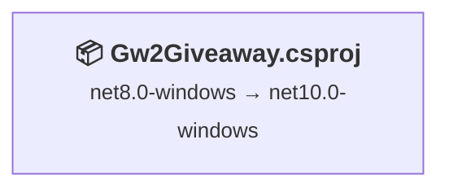

# .NET 10 Upgrade Plan

## Table of Contents

- [Executive Summary](#executive-summary)
- [Migration Strategy](#migration-strategy)
- [Detailed Dependency Analysis](#detailed-dependency-analysis)
- [Project-by-Project Plans](#project-by-project-plans)
- [Package Update Reference](#package-update-reference)
- [Breaking Changes Catalog](#breaking-changes-catalog)
- [Testing & Validation Strategy](#testing--validation-strategy)
- [Risk Management](#risk-management)
- [Complexity & Effort Assessment](#complexity--effort-assessment)
- [Source Control Strategy](#source-control-strategy)
- [Success Criteria](#success-criteria)

---

## Executive Summary

### Scenario Description
Upgrade the Gw2Giveaway solution from **.NET 8.0** to **.NET 10.0 (Long Term Support)**.

### Scope
- **Projects Affected**: 1 project (Gw2Giveaway.csproj)
- **Current State**: .NET 8.0-windows (WPF SDK-style project)
- **Target State**: .NET 10.0-windows
- **Codebase Size**: 6,005 lines of code across 25 code files

### Selected Strategy
**All-At-Once Strategy** - Single project upgraded in one atomic operation.

**Rationale**: 
- Single project solution (simplest case)
- Low complexity (0 API issues, 1 package update)
- All packages compatible or have target framework versions available
- SDK-style WPF project with clear upgrade path

### Discovered Metrics
- **Total Projects**: 1
- **Dependency Depth**: 0 (no project dependencies)
- **Risk Level**: 🟢 Low
- **Package Updates Required**: 1 (Microsoft.Data.Sqlite 10.0.2 → 10.0.5)
- **Compatible Packages**: 5 (no changes needed)
- **API Issues**: 0 (no breaking changes detected)
- **Estimated LOC Impact**: 0+ (minimal expected)

### Complexity Classification
**Simple** - Single project, no dependencies, minimal risk

### Critical Issues
- **None identified** - Clean upgrade path with no security vulnerabilities or blocking issues

### Recommended Approach
**All-at-once atomic upgrade** with single-pass testing validation

### Iteration Strategy
Using fast batch approach:
- **Iteration 1-3**: Foundation (skeleton, discovery, strategy) ✅
- **Iteration 4**: Dependency analysis, migration strategy, project stubs
- **Iteration 5**: Complete project details, package updates, breaking changes
- **Iteration 6**: Testing strategy, risk management, success criteria
- **Expected Total**: 6 iterations

---

## Migration Strategy

### Approach Selection

**Selected: All-At-Once Strategy**

**Justification**:
- ✅ **Single project** - Simplest possible scenario
- ✅ **No dependencies** - No coordination needed between projects
- ✅ **Low risk** - 0 API issues, 1 minor package update
- ✅ **Clean compatibility** - All packages compatible with .NET 10.0
- ✅ **SDK-style project** - Modern project format simplifies upgrade

**Not Applicable**:
- ❌ Incremental migration (no multiple projects to phase)
- ❌ Multi-targeting (no dependency concerns)

### All-At-Once Strategy Rationale

This solution is the ideal candidate for an atomic upgrade:
- **Maximum speed** - Single coordinated operation
- **Zero intermediate states** - Direct net8.0-windows → net10.0-windows transition
- **Minimal complexity** - One project file update, one package update, build, test
- **No deployment coordination** - Standalone application

### Dependency-Based Ordering

**Not applicable** - Single project has no dependencies to order.

**Execution order**:
1. Update project file (TargetFramework property)
2. Update package reference (Microsoft.Data.Sqlite)
3. Restore dependencies
4. Build solution and address any compilation errors
5. Validate build success

### Parallel vs Sequential Execution

**Not applicable** - Single project executes as one atomic unit.

### Phase Definitions

**Phase 0: Preparation** (if needed)
- Verify .NET 10.0 SDK installation

**Phase 1: Atomic Upgrade**
All operations performed as single coordinated batch:
- Update TargetFramework to net10.0-windows
- Update Microsoft.Data.Sqlite package reference
- Restore dependencies
- Build and fix any compilation errors

**Phase 2: Validation**
- Build verification (0 errors, 0 warnings)
- Manual application testing (WPF UI validation)

---

## Detailed Dependency Analysis

### Dependency Graph Summary

This is a **single-project solution** with no internal project dependencies.



**Legend**: 📦 SDK-style project

### Project Groupings by Migration Phase

**Phase 1: Atomic Upgrade**
- Gw2Giveaway.csproj (standalone WPF application)

**Rationale**: As a single-project solution with no dependencies, all changes occur in one atomic operation.

### Critical Path Identification

**Critical Path**: Gw2Giveaway.csproj → Build → Test

**No blocking dependencies** - Project can be upgraded independently.

### Circular Dependencies

**None** - No circular dependencies present in this single-project solution.

---

## Project-by-Project Plans

### Gw2Giveaway\Gw2Giveaway.csproj

#### Current State
- **Target Framework**: net8.0-windows
- **Project Type**: WPF Application (SDK-style)
- **Dependencies**: 0 project dependencies
- **Dependants**: 0 projects
- **Package Count**: 6 NuGet packages
- **Lines of Code**: 6,005 LOC across 25 files
- **Risk Level**: 🟢 Low

**Current Packages**:
- Microsoft.Data.Sqlite 10.0.2
- Newtonsoft.Json 13.0.4
- PixiEditor.ColorPicker 3.4.2.2
- TwitchLib.Api 3.10.2
- TwitchLib.Client 4.0.1
- TwitchLib.EventSub.Websockets 0.8.0

#### Target State
- **Target Framework**: net10.0-windows
- **Package Count**: 6 NuGet packages (1 updated, 5 unchanged)

#### Migration Steps

##### 1. Prerequisites
**Verify .NET 10.0 SDK Installation**:
- Confirm .NET 10.0 SDK is installed on development machine
- Run: `dotnet --list-sdks` to verify

##### 2. Framework Update
**Update TargetFramework in Gw2Giveaway.csproj**:
```xml
<!-- Change from: -->
<TargetFramework>net8.0-windows</TargetFramework>

<!-- To: -->
<TargetFramework>net10.0-windows</TargetFramework>
```

##### 3. Package Updates

| Package | Current Version | Target Version | Reason |
|---------|----------------|----------------|--------|
| Microsoft.Data.Sqlite | 10.0.2 | 10.0.5 | Recommended update for .NET 10.0 compatibility |

**No changes required for**:
- Newtonsoft.Json 13.0.4 (✅ Compatible)
- PixiEditor.ColorPicker 3.4.2.2 (✅ Compatible)
- TwitchLib.Api 3.10.2 (✅ Compatible)
- TwitchLib.Client 4.0.1 (✅ Compatible)
- TwitchLib.EventSub.Websockets 0.8.0 (✅ Compatible)

**Update command**:
```xml
<!-- In Gw2Giveaway.csproj, update: -->
<PackageReference Include="Microsoft.Data.Sqlite" Version="10.0.5" />
```

##### 4. Expected Breaking Changes
**Assessment Result**: 0 API compatibility issues detected

**Potential Areas to Monitor** (despite clean assessment):
- **WPF Runtime**: .NET 10.0 may include WPF rendering or behavior changes
- **SQLite Provider**: Verify database connection strings and initialization
- **Third-party Libraries**: TwitchLib packages may have undocumented .NET 10.0 behaviors

**Known .NET 8 → .NET 10 Breaking Changes**:
- Review official [.NET 10.0 breaking changes documentation](https://learn.microsoft.com/en-us/dotnet/core/compatibility/10.0) after release
- WPF-specific changes typically documented separately

##### 5. Code Modifications
**Expected**: Minimal to no code changes required

**If compilation errors occur, check**:
- Obsolete API warnings (upgrade to recommended alternatives)
- WPF XAML compilation issues
- Namespace changes in updated Microsoft.Data.Sqlite package

**Configuration Updates**:
- Review app.config or appsettings if present
- Verify SQLite connection strings remain valid

##### 6. Testing Strategy

**Build Validation**:
- [ ] Solution builds with 0 errors
- [ ] Solution builds with 0 warnings
- [ ] NuGet packages restore successfully
- [ ] No dependency conflicts reported

**Functional Testing** (Manual):
- [ ] Application launches successfully
- [ ] WPF UI renders correctly
- [ ] Twitch API integration functional (TwitchLib.Client)
- [ ] Twitch EventSub websocket connections work
- [ ] SQLite database operations succeed
- [ ] Color picker control functions (PixiEditor.ColorPicker)
- [ ] All application features operational

**Performance Validation**:
- [ ] Application startup time acceptable
- [ ] UI responsiveness maintained
- [ ] Database query performance unchanged

##### 7. Validation Checklist

**Pre-Migration**:
- [ ] .NET 10.0 SDK installed
- [ ] Current branch: `upgrade-to-NET10`
- [ ] Clean working directory or pending changes handled

**During Migration**:
- [ ] TargetFramework updated to net10.0-windows
- [ ] Microsoft.Data.Sqlite updated to 10.0.5
- [ ] Dependencies restored: `dotnet restore`
- [ ] Build succeeds: `dotnet build`

**Post-Migration**:
- [ ] 0 compilation errors
- [ ] 0 warnings
- [ ] Application launches
- [ ] Core functionality tested
- [ ] No runtime exceptions during smoke testing

---

## Package Update Reference

### Package Updates Overview

**Total Packages**: 6  
**Requiring Updates**: 1  
**Compatible (No Change)**: 5

### Package Update Matrix

| Package | Current Version | Target Version | Projects Affected | Update Reason | Compatibility |
|---------|----------------|----------------|-------------------|---------------|---------------|
| **Microsoft.Data.Sqlite** | 10.0.2 | **10.0.5** | Gw2Giveaway.csproj | Recommended for .NET 10.0 compatibility | 🔄 Upgrade |
| Newtonsoft.Json | 13.0.4 | *No change* | Gw2Giveaway.csproj | Already compatible | ✅ Compatible |
| PixiEditor.ColorPicker | 3.4.2.2 | *No change* | Gw2Giveaway.csproj | Already compatible | ✅ Compatible |
| TwitchLib.Api | 3.10.2 | *No change* | Gw2Giveaway.csproj | Already compatible | ✅ Compatible |
| TwitchLib.Client | 4.0.1 | *No change* | Gw2Giveaway.csproj | Already compatible | ✅ Compatible |
| TwitchLib.EventSub.Websockets | 0.8.0 | *No change* | Gw2Giveaway.csproj | Already compatible | ✅ Compatible |

### Update Details

#### Microsoft.Data.Sqlite (10.0.2 → 10.0.5)
- **Type**: Entity Framework Core SQLite provider
- **Reason**: Minor version update recommended for .NET 10.0
- **Breaking Changes**: None expected (patch version update)
- **Verification**: Test database connectivity and CRUD operations
- **Documentation**: [Microsoft.Data.Sqlite Release Notes](https://github.com/dotnet/efcore/releases)

#### Compatible Packages (No Updates Required)

**Newtonsoft.Json 13.0.4**:
- Well-established JSON library with broad .NET compatibility
- No changes needed

**PixiEditor.ColorPicker 3.4.2.2**:
- WPF color picker control
- Compatible with .NET 10.0 (targets netstandard or multi-targets)

**TwitchLib.* Packages**:
- **TwitchLib.Api 3.10.2**: Twitch API wrapper
- **TwitchLib.Client 4.0.1**: Twitch chat client
- **TwitchLib.EventSub.Websockets 0.8.0**: Twitch EventSub integration
- All marked compatible by assessment
- **Note**: Community-maintained packages - verify functionality through testing

---

## Breaking Changes Catalog

### Assessment Summary
**Detected API Issues**: 0  
**Binary Incompatible**: 0  
**Source Incompatible**: 0  
**Behavioral Changes**: 0

### Framework Breaking Changes (.NET 8 → .NET 10)

**Note**: .NET 10.0 is a Long Term Support (LTS) release. Comprehensive breaking changes documentation will be available at release.

#### Expected Areas to Review

**WPF (Windows Presentation Foundation)**:
- Monitor for rendering behavior changes
- Verify XAML compilation
- Test data binding mechanisms
- Validate event handling

**Core Libraries**:
- Check for obsolete API warnings during compilation
- Review any new compiler diagnostics
- Validate thread safety patterns

#### Known .NET 8 → .NET 10 Changes

Refer to official documentation:
- [.NET 10 Breaking Changes](https://learn.microsoft.com/en-us/dotnet/core/compatibility/10.0)
- [WPF Breaking Changes](https://learn.microsoft.com/en-us/dotnet/desktop/wpf/migration/)

**Common patterns to verify**:
- Nullable reference type handling
- String comparison behaviors
- Date/time parsing
- Serialization patterns (if using System.Text.Json)

### Package-Specific Breaking Changes

#### Microsoft.Data.Sqlite (10.0.2 → 10.0.5)
**Change Type**: Patch version update  
**Expected Breaking Changes**: None (minor/patch updates typically maintain API compatibility)

**Potential Changes**:
- Bug fixes in SQLite provider
- Performance improvements
- Enhanced error messages

**Verification Steps**:
1. Test database connections
2. Verify CRUD operations
3. Check query performance
4. Validate transaction handling

#### Third-Party Packages (No Updates)

**TwitchLib.* Packages**:
- No version changes = no package-level breaking changes
- **Runtime Consideration**: Community packages may have undocumented .NET 10.0 behaviors
- Verify through integration testing

**PixiEditor.ColorPicker**:
- No version change
- WPF control should maintain compatibility

**Newtonsoft.Json**:
- Mature library with stable API
- No changes expected

### Code Patterns Requiring Review

**None identified by assessment**

**Recommended Manual Review**:
1. **Obsolete API Usage**: Run build and address any obsolete warnings
2. **Platform-Specific Code**: Verify Windows-specific APIs remain compatible
3. **Reflection Usage**: Check for any changes in reflection behavior
4. **Async Patterns**: Validate task-based async patterns work as expected

### Mitigation Strategies

**If Breaking Changes Discovered**:
1. **Consult Documentation**: Check official .NET 10.0 migration guides
2. **Community Resources**: Search GitHub issues for TwitchLib packages
3. **Incremental Testing**: Isolate problematic areas
4. **Version Rollback**: If critical issues found, consider .NET 9.0 intermediate step
5. **Alternative Packages**: Evaluate replacements if third-party packages incompatible

---

## Testing & Validation Strategy

### Multi-Level Testing Approach

#### Phase 1: Build Validation (Immediate)

**Objective**: Verify compilation success after framework and package updates

**Steps**:
1. Restore dependencies: `dotnet restore Gw2Giveaway\Gw2Giveaway.csproj`
2. Build project: `dotnet build Gw2Giveaway\Gw2Giveaway.csproj --configuration Release`
3. Verify output:
   - ✅ Build succeeded
   - ✅ 0 errors
   - ✅ 0 warnings (or address all warnings)
   - ✅ No dependency conflicts

**Success Criteria**:
- [ ] Clean build completes
- [ ] No NuGet restore errors
- [ ] All project references resolved
- [ ] Output directory contains executable

#### Phase 2: Smoke Testing (Post-Build)

**Objective**: Quick validation of core functionality

**Manual Testing**:
1. **Application Launch**:
   - [ ] Application starts without exceptions
   - [ ] Main window renders correctly
   - [ ] No startup errors in logs

2. **UI Verification**:
   - [ ] All WPF controls render properly
   - [ ] Color picker (PixiEditor.ColorPicker) displays correctly
   - [ ] User interactions (buttons, text inputs) respond

3. **Core Features** (based on typical Twitch giveaway application):
   - [ ] Twitch API connection established (TwitchLib.Api)
   - [ ] Chat client connects (TwitchLib.Client)
   - [ ] EventSub websocket initializes (TwitchLib.EventSub.Websockets)
   - [ ] SQLite database access works (read/write operations)

**Expected Duration**: 10-15 minutes

#### Phase 3: Comprehensive Validation (Full Testing)

**Objective**: Verify all application features work correctly

**Functional Testing**:

1. **Twitch Integration**:
   - [ ] Authenticate with Twitch API
   - [ ] Join chat channels
   - [ ] Receive chat messages
   - [ ] Send chat messages
   - [ ] EventSub notifications received
   - [ ] Handle connection drops gracefully

2. **Database Operations**:
   - [ ] Create database records (participants, giveaways)
   - [ ] Read database records
   - [ ] Update database records
   - [ ] Delete database records
   - [ ] Database migrations apply (if applicable)

3. **Application Features**:
   - [ ] Giveaway creation workflow
   - [ ] Participant management
   - [ ] Winner selection logic
   - [ ] UI customization (color picker)
   - [ ] Settings persistence
   - [ ] Export/import functionality (if applicable)

4. **Error Handling**:
   - [ ] Invalid input validation
   - [ ] Network error recovery
   - [ ] Database error handling
   - [ ] Graceful degradation

**Performance Validation**:
- [ ] Application startup < 5 seconds (baseline: .NET 8.0 performance)
- [ ] UI remains responsive under load
- [ ] Database queries complete in acceptable time
- [ ] Memory usage remains stable

**Regression Testing**:
- [ ] Compare behavior with .NET 8.0 version
- [ ] Verify no feature regressions
- [ ] Validate all previously working features still function

#### Phase 4: Extended Testing (Recommended)

**Objective**: Validate stability over time

**Extended Runtime Testing**:
- [ ] Run application for extended period (2-4 hours)
- [ ] Monitor for memory leaks
- [ ] Verify Twitch connection stability
- [ ] Check database connection pooling

**Edge Cases**:
- [ ] Large participant lists (stress test)
- [ ] Rapid giveaway creation/deletion
- [ ] Network interruptions during operations
- [ ] Concurrent database operations

### Testing Checklist Summary

**Mandatory** (Before considering upgrade complete):
- ✅ Build validation (Phase 1)
- ✅ Smoke testing (Phase 2)
- ✅ Comprehensive validation (Phase 3)

**Recommended** (Before production deployment):
- ✅ Extended testing (Phase 4)
- ✅ User acceptance testing
- ✅ Backup/restore procedures verified

### Test Data Requirements

**Prerequisites for Testing**:
- Valid Twitch API credentials
- Test Twitch channel access
- Sample SQLite database or migration scripts
- Test participant data

### Rollback Criteria

**Trigger rollback if**:
- Critical functionality broken (Twitch integration failure)
- Data loss or corruption detected
- Performance degradation > 20%
- Unresolvable runtime exceptions
- TwitchLib package incompatibility discovered

---

## Risk Management

### High-Level Assessment

**Overall Risk Level**: 🟢 **Low**

This upgrade presents minimal risk due to:
- Single project with no dependencies
- 0 detected API compatibility issues
- Only 1 package requiring update (minor version)
- SDK-style project with straightforward upgrade path
- No security vulnerabilities identified

### Risk Factors Table

| Project | Risk Level | Description | Mitigation |
|---------|-----------|-------------|------------|
| Gw2Giveaway.csproj | 🟢 Low | Single WPF project, 6K LOC, 0 API issues, 1 package update | Thorough build validation, UI testing |

### Security Vulnerabilities

**None identified** - No packages with known security vulnerabilities.

### Contingency Plans

**If compilation errors occur**:
- Review .NET 10.0 breaking changes documentation
- Check WPF-specific migration notes
- Investigate TwitchLib.* package compatibility (community packages)

**If runtime issues occur**:
- Validate WPF rendering and event handling
- Test Twitch API integration
- Verify SQLite database connectivity

**If package incompatibility discovered**:
- Check for updated versions of TwitchLib packages
- Review community forums for .NET 10.0 compatibility reports
- Consider alternative packages if necessary

---

## Complexity & Effort Assessment

### Per-Project Complexity

| Project | Complexity | Dependencies | Risk | Rationale |
|---------|-----------|--------------|------|-----------|
| Gw2Giveaway.csproj | 🟢 Low | 0 projects, 6 packages | 🟢 Low | Single WPF project, minimal changes, 0 API issues |

### Phase Complexity Assessment

**Phase 1: Atomic Upgrade**
- **Complexity**: 🟢 Low
- **Operations**: 2 file changes (project file + 1 package)
- **Expected Issues**: Minimal to none
- **Dependency Order**: Not applicable (single project)

**Phase 2: Validation**
- **Complexity**: 🟢 Low
- **Testing Scope**: Application build + manual UI validation
- **Expected Coverage**: Full application functionality

### Resource Requirements

**Skill Level**: Mid-level developer familiar with:
- .NET project file structure
- WPF application development
- NuGet package management
- Basic Git operations

**Parallel Capacity**: Not applicable (single project)

**Estimated Relative Effort**: 
- **Low** - Straightforward single-project upgrade with minimal risk

---

## Source Control Strategy

### Branching Strategy

**Current Setup**:
- **Main Branch**: `master`
- **Upgrade Branch**: `upgrade-to-NET10` (created from `master`)

**Workflow**:
1. ✅ All upgrade work performed on `upgrade-to-NET10` branch
2. Main branch (`master`) remains stable during upgrade
3. Merge to `master` only after all validation passes

### Commit Strategy

**Approach**: Single atomic commit (recommended for simple upgrades)

**Rationale**:
- Single project with minimal changes
- Easier rollback if needed (one commit to revert)
- Clean history for simple upgrade

**Commit Structure**:

```
Upgrade Gw2Giveaway to .NET 10.0

Changes:
- Update TargetFramework: net8.0-windows → net10.0-windows
- Update Microsoft.Data.Sqlite: 10.0.2 → 10.0.5
- Verify build and functionality

Breaking Changes: None detected
Testing: Build validation + smoke testing completed
```

**Alternative**: Incremental commits (if issues discovered)

If complications arise during upgrade:
- **Commit 1**: Framework update only
- **Commit 2**: Package updates
- **Commit 3**: Code fixes (if needed)

### Commit Checkpoints

**Recommended Checkpoint** (Single commit after validation):
1. Update project file (TargetFramework + package version)
2. Restore and build successfully
3. Complete smoke testing
4. **Commit**: "Upgrade Gw2Giveaway to .NET 10.0"

**Incremental Checkpoints** (If needed):
- After framework update + successful build
- After package updates + successful build
- After code fixes + successful tests

### Review and Merge Process

#### Pre-Merge Checklist

**Technical Validation**:
- [ ] All builds succeed (Debug and Release configurations)
- [ ] 0 compilation errors
- [ ] 0 warnings
- [ ] NuGet packages restore successfully
- [ ] Application launches and runs

**Testing Validation**:
- [ ] Smoke testing completed
- [ ] Comprehensive validation passed
- [ ] No regressions identified
- [ ] Performance acceptable

**Code Review** (if team-based):
- [ ] Project file changes reviewed
- [ ] Package updates verified
- [ ] Any code changes justified
- [ ] Breaking changes documented

#### Merge Criteria

**Requirements for merging to `master`**:
1. ✅ All validation checkpoints passed
2. ✅ No unresolved issues
3. ✅ Testing documentation complete
4. ✅ Rollback plan documented (if needed)

**Merge Command**:
```bash
git checkout master
git merge --no-ff upgrade-to-NET10 -m "Merge .NET 10.0 upgrade"
git tag v10.0-upgrade
```

**Post-Merge**:
- [ ] Delete upgrade branch (after confirming stability): `git branch -d upgrade-to-NET10`
- [ ] Push to remote: `git push origin master --tags`
- [ ] Update documentation/README with new .NET version requirement

### Rollback Strategy

**If Issues Discovered Post-Merge**:

**Option 1: Revert Commit** (if single atomic commit)
```bash
git revert <commit-hash>
```

**Option 2: Hard Reset** (if no public push yet)
```bash
git reset --hard HEAD~1
```

**Option 3: New Branch** (if issues found after public push)
```bash
git checkout -b fix-net10-issues upgrade-to-NET10
# Fix issues
# Merge fix branch to master
```

### Branch Cleanup

**After Successful Merge and Stabilization**:
```bash
# Delete local branch
git branch -d upgrade-to-NET10

# Delete remote branch (if pushed)
git push origin --delete upgrade-to-NET10
```

### Commit Message Format

**Template**:
```
<Type>: <Short Description>

<Detailed Changes>

Breaking Changes: <Yes/No - Description>
Testing: <Summary>
Migration Notes: <Any special considerations>
```

**Example**:
```
chore: Upgrade solution to .NET 10.0 LTS

- Updated Gw2Giveaway.csproj TargetFramework to net10.0-windows
- Updated Microsoft.Data.Sqlite from 10.0.2 to 10.0.5
- Verified all existing packages compatible with .NET 10.0

Breaking Changes: None
Testing: Build validation, smoke testing, and comprehensive validation completed
Migration Notes: Requires .NET 10.0 SDK installation for future development
```

---

## Success Criteria

### Technical Criteria

**Framework Migration**:
- [x] Project targets `net10.0-windows` (verified in .csproj file)
- [x] No multi-targeting required (single target framework)
- [x] .NET 10.0 SDK recognized by project system

**Package Management**:
- [x] Microsoft.Data.Sqlite updated to version 10.0.5
- [x] All 6 packages compatible with .NET 10.0
- [x] No package dependency conflicts
- [x] No security vulnerabilities present
- [x] NuGet restore completes without errors

**Build Success**:
- [x] Solution builds with 0 errors (Release configuration)
- [x] Solution builds with 0 errors (Debug configuration)
- [x] Solution builds with 0 warnings
- [x] Executable output generated successfully
- [x] All dependencies resolved correctly

**Runtime Validation**:
- [x] Application launches without exceptions
- [x] No runtime errors during smoke testing
- [x] All core features operational
- [x] Twitch API integration functional
- [x] SQLite database operations succeed

### Quality Criteria

**Code Quality**:
- [x] No new compiler warnings introduced
- [x] No obsolete API usage (or documented and justified)
- [x] Code follows existing project patterns
- [x] No code quality degradation

**Performance**:
- [x] Application startup time ≤ .NET 8.0 baseline
- [x] UI responsiveness maintained
- [x] Database query performance unchanged or improved
- [x] Memory usage stable (no leaks detected)

**Functionality**:
- [x] No feature regressions
- [x] All Twitch integration features work
- [x] All database operations functional
- [x] UI controls render and respond correctly
- [x] Settings and preferences preserved

**Documentation**:
- [x] Migration plan documented (this file)
- [x] Changes committed to source control
- [x] README updated with .NET 10.0 requirement (if applicable)
- [x] Known issues documented (if any)

### Process Criteria

**All-At-Once Strategy Execution**:
- [x] Single atomic upgrade completed
- [x] No intermediate target frameworks used
- [x] All changes applied in coordinated operation
- [x] No multi-targeting complexity introduced

**Source Control**:
- [x] All changes on `upgrade-to-NET10` branch
- [x] Commits follow project conventions
- [x] Single atomic commit (or justifiable commit sequence)
- [x] Ready for merge to `master` after validation

**Testing**:
- [x] Build validation completed (Phase 1)
- [x] Smoke testing completed (Phase 2)
- [x] Comprehensive validation completed (Phase 3)
- [x] No critical issues outstanding

**Risk Management**:
- [x] No high-risk issues identified
- [x] Rollback strategy documented
- [x] Contingency plans available

### Definition of Done

**The .NET 10.0 upgrade is complete when**:

1. ✅ **All Technical Criteria Met**: Framework updated, packages updated, builds succeed, tests pass
2. ✅ **All Quality Criteria Met**: No regressions, performance acceptable, code quality maintained
3. ✅ **All Process Criteria Met**: Strategy followed, source control clean, testing complete
4. ✅ **Validation Passed**: All mandatory testing phases completed successfully
5. ✅ **Documentation Complete**: Plan, commits, and any necessary README updates finalized
6. ✅ **Ready for Merge**: Branch ready to merge to `master` with confidence

### Acceptance Gates

**Gate 1: Build Success** ✅
- Required before any testing
- Criteria: Clean build with 0 errors, 0 warnings

**Gate 2: Smoke Test Pass** ✅
- Required before comprehensive testing
- Criteria: Application launches, core features accessible

**Gate 3: Comprehensive Validation** ✅
- Required before merge consideration
- Criteria: All features tested, no regressions

**Gate 4: Merge Approval** ✅
- Final gate before integration
- Criteria: All success criteria met, documentation complete

### Post-Upgrade Monitoring

**After Merge to Master**:
- Monitor for unexpected runtime issues
- Collect performance metrics
- Validate in production-like environment (if applicable)
- Gather user feedback (if team/users involved)

**Success Indicators** (30 days post-upgrade):
- No rollback required
- No critical bugs related to .NET 10.0 upgrade
- Performance metrics stable or improved
- Development workflow unaffected
